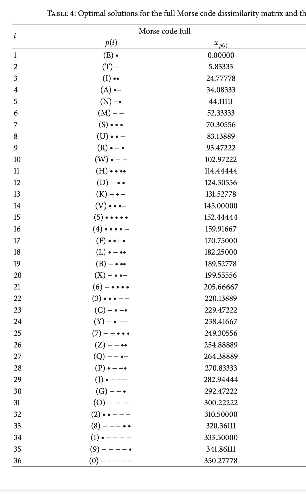

<style type="text/css">

body{ /* Normal  */
   font-size: 18px;
}
td {  /* Table  */
   font-size: 18px;
}
h1 { /* Header 1 */
 font-size: 28px;
 color: DarkBlue;
}
h2 { /* Header 2 */
 font-size: 22px;
 color: DarkBlue;
}
h3 { /* Header 3 */
 font-size: 18px;
 color: DarkBlue;
}
code.r{ /* Code block */
  font-size: 18px;
}
pre { /* Code block */
  font-size: 18px
}
</style>

<script type="text/x-mathjax-config">
MathJax.Hub.Config({
  TeX: { equationNumbers: { autoNumber: "AMS" } }
});
</script>

```{r function_code, echo = FALSE}
source("penalty.R")
source("matchMe.R")
source("runPenalty.R")
source("plotMe.R")
source("checkUni.R")
```

```{r mprint, echo = FALSE}
mprint <- function (x,
                    d = 6,
                    w = 8,
                    f = "") {
  print (noquote (formatC (
    x,
    di = d,
    wi = w,
    fo = "f",
    flag = f
  )))
}
```
```{r packages, echo = FALSE}
options (digits = 10) 
suppressPackageStartupMessages (library (captioner, quietly = TRUE))
```
```{r theorems, echo = FALSE}
theorem_nums <- captioner (prefix = "Theorem")
theorem_nums (name = "perturb", caption = "[FDS Local Minima]", display = FALSE)
theorem_nums (name = "local", caption = "[PFDS Local Minima]", display = FALSE)
lemma_nums <- captioner (prefix = "Lemma")
lemma_nums (name = "deriv", caption = "[Expand]", display = FALSE)
lemma_nums (name = "basic", caption = "[Basic]", display = FALSE)
corrollary_nums <- captioner (prefix = "Corrollary")
corrollary_nums(name = "saddle", caption = "[Saddle]", display = FALSE)
corrollary_nums(name = "nested", caption = "[Nested]", display = FALSE)
appendix_nums <- captioner (prefix = "Appendix", type = "C")
appendix_nums(name = "epm", caption = "Exterior Penalty Methods", display = FALSE)
appendix_nums(name = "code", caption = "Code", display = FALSE)
```

**Note:** This is a working paper which will be expanded/updated frequently. All suggestions for improvement are welcome. The directory [deleeuwpdx.net/pubfolders/penalty](http://deleeuwpdx.net/pubfolders/penalty) has a pdf version, a html version, the bib files, the complete Rmd file with the code chunks, and the R source code.

# Introduction

We start with a reformulation of the  (metric, Euclidean, least squares) multidimensional scaling (MDS) problem. 
The main difference with previous formulations, described most thoroughly in @borg_groenen_05, is that we parametrize the problem by using the *cross-product matrix*, and not by using the *configuration matrix*.

The *data* of an MDS problem are non-negative, symmetric, and hollow matrices $W=\{w_{ij}\}$ and $\Delta=\{\delta_{ij}\}$ of order $n$, containing *weights* and *dissimilarities*. We assume that $W$ is irreducible, so that the MDS problem is not equivalent to a number of smaller MDS problems.

For any $1\leq p\leq n-1$ we define the *pMDS problem* as the minimization od
\begin{equation}\label{E:stress}
\sigma(C)=\frac12\mathop{\sum\sum}_{1\leq i<j\leq n}w_{ij}(\delta_{ij}-d_{ij}(C))^2
\end{equation}
over all $n\times n$ matrices $C$ which satisfy

 1. $C$ is symmetric and doubly-centered (SDC), i.e. rows and columns add up to zero.
 2. $C\gtrsim 0$, i.e. $C$ is positive semi-definite (PSD).
 3. $\text{rank}(C)\leq p$.

Here $D(C)=\{d_{ij}(C)\}$ is a matrix of Euclidean distances, i.e.
$d_{ij}(C)=\sqrt{c_{ii}+c_{jj}-2c_{ij}}$.
Special cases are unidimensional scaling, which is 1MDS, and full-dimensional scaling, which is (n-1)MDS. They deserve their own acronyms, so we'll refer to them as UDS and FDS.

We now introduce some standard MDS notation, following @deleeuw_C_77. Define the unit vectors $e_i$, which have element $i$ equal to one and all other elements equal to zero. For $i<j$ define the matrices
$$A_{ij}=(e_i-e_j)(e_i-e_j)'.$$
Note that $d_{ij}(C)=\sqrt{\text{tr}\ A_{ij}C}$. Also note the $A_{ij}$ are a basis for the $\frac12 n(n-1)$ dimensional subspace of SDC matrices of order $n$. In fact for any SDC matrix $C=\{c_{ij}\}$ we have
$$
C=-\mathop{\sum\sum}_{1\leq i<j\leq n}c_{ij}A_{ij}.
$$


Next, define the matrix $V=\{v_{ij}\}$ by
\begin{equation}\label{E:V}
V=\mathop{\sum\sum}_{1\leq i<j\leq n}w_{ij}A_{ij}.
\end{equation}
Matrix $V$ is PSD and SDC, and because of irreducibility it has rank $n-1$. The vectors in the null-space of $V$ are all proportional to $u$, a vector with all elements equal to one. 

Also define the matrix valued function $B(C)=\{b_{ij}(C)\}$ by
\begin{equation}\label{E:B}
B(C)=\mathop{\sum\sum}_{1\leq i<j\leq n}w_{ij}r_{ij}(C)A_{ij}
\end{equation}
where 
$$
r_{ij}(C)=\begin{cases}\frac{\delta_{ij}}{d_{ij}(C)}&\text{ if }d_{ij}(C)>0,\\
0&\text{ if }d_{ij}(C)=0.
\end{cases}
$$q
If $C$ is PSD and SDC then $B(C)$ is also PSD and SDC. Its rank is less than or equal to $n-1$, with equality if and only if the Hadamard product $W\star R(C)$ is irreducible.  

We also assume, without loss of generality, that dissimilarities are normalized as
$$
\frac12\mathop{\sum\sum}_{1\leq i<j\leq n}w_{ij}\delta_{ij}^2=1.
$$
With these definitions we can rewrite the stress $\eqref{E:stress}$ as
\begin{equation}\label{E:mstress}
\sigma(C)=1-\mathbf{tr}\ B(C)C+\frac12\mathbf{tr}\ VC.
\end{equation}

# Configuration

Suppose $C=ZZ'$, with $Z$ and $n\times p$ matrix of rank $p$. If $\sigma$ has a local minimum at $C$
then $(V-B(C))Z=0$ and $d_{ij}(C)>0$ for all $i<j$ with $w_{ij}\delta_{ij}>0$.

$C=ZZ'$ $\tilde C=(Z+\epsilon E)(Z+\epsilon E)'=C+\epsilon(EZ'+ZE')+\epsilon^2 EE'$
$$
d_{ij}^2(\tilde C)=d_{ij}^2(C)+2\epsilon\ \text{tr}\ Z'A_{ij}E+\epsilon^2d_{ij}^2(F)
$$
If $d_{ij}(C)=0$ then $d_{ij}^2(\tilde C)=\epsilon^2d_{ij}^2(F)$

If $d_{ij}(C)>0$

$$
d_{ij}(\tilde C)=d_{ij}(C)\sqrt{1+2\epsilon\ \frac{\text{tr}\ Z'A_{ij}E}{d_{ij}^2(C)}+\epsilon^2\frac{d_{ij}^2(F)}{d_{ij}^2(C)}}
$$
$$
d_{ij}(\tilde C)=d_{ij}(C)+\epsilon\ \frac{\text{tr}\ Z'A_{ij}E}{d_{ij}(C)}+\frac12\epsilon^2\left\{\frac{d_{ij}^2(F)}{d_{ij}(C)}-\frac{(\text{tr}\ Z'A_{ij}E)^2}{d_{ij}^3(C)}\right\}+o(\epsilon^2)
$$
\begin{align*}
\sigma(\tilde C)&=\sigma(C)+\epsilon\ \text{tr}\ Z'(V_+-B(C))E-\epsilon\mathop{\sum}_{d_{ij}(C)=0}w_{ij}\delta_{ij}d_{ij}(F)+\\
&+\frac12\epsilon^2\left[\text{tr}\ VF-\mathop{\sum}_{d_{ij}(C)>0}w_{ij}r_{ij}(C)\left\{d_{ij}^2(F)-\frac{((z_i-z_j)'(e_i-e_j))^2}{d_{ij}^2(C)}\right\}\right]+o(\epsilon^2)
\end{align*}

# FDS

The definition $\eqref{E:mstress}$ shows that the CFDS loss function is a convex function on the cone of positive semi-definite matrices, because the square root of a non-negative linear function of the elements of $C$ is concave. Positivity of the weights and dissimilarities implies that loss is actually strictly convex. The necessary and sufficient conditions for $C$ to be the unique solution of the CFDS problem are simply the conditions for a proper convex function to attain its minimum at $C$ on a closed convex cone (@rockafellar_70, theorem 31.4).
\begin{align*}
V-B(C)&\gtrsim 0,\\
C&\gtrsim 0,\\
\mathbf{tr}\ C(V-B(C))&=0.
\end{align*}
The conditions say that $C$ and $V-B(C)$ must be positive semi-definite and have complimentary null spaces.

If $C$ is the solution of the FMDS problem then $\mathbf{rank}(C)$ is called the *Gower rank* of the MDS problem defined by $W$ and $\Delta$ (@deleeuw_E_16k). Although there is a unique Gower rank associated with each 
pair $(W,\Delta)$, we can also talk about the *approximate Gower rank* by ignoring the small eigenvalues of $C$.

# FDS using SMACOF

The usual SMACOF algorithm can be applied to FMDS as well. The iterations start with $Z^{(0)}$ and use the update rule
\begin{equation}\label{E:smacof}
Z^{(k+1)}=V^+B(Z^{(k)})Z^{(k)},
\end{equation}
where $V^+$ is the Moore-Penrose inverse of $V$, and is consequently also doubly-centered. This means that all $Z^{(k)}$ in the SMACOF sequence, except possibly $Z^{(0)}$, are column-centered and of rank at most $n-1$. Equation $\eqref{E:smacof}$ also shows that if $Z^{(0)}$ is of rank $p<n-1$ then all $Z^{(k)}$ are of rank $p$ as well.

@deleeuw_C_77 shows global convergence of the SMACOF sequence for pMDS, generated by $\eqref{E:smacof}$, to a stationary point, i.e. a point satisfying $(V-B(Z))Z=0$. This result also applies, of course, to nMDS, i.e. FDS. If $Z$ is a solution of the stationary equations then with $C=ZZ'$ we have both $(V-B(C))C=0$ and $C\gtrsim 0$, but since we generally do not have $V-B(Z)\gtrsim 0$, this does not mean that $C$ solves the CFDS problem. 

In fact, suppose the unique CMDS solution has Gower rank $r\geq 2$. Start the SMACOF FDS iterations $\eqref{E:smacof}$ with $Z^{(0)}$ of the form $Z^{(0)}=\begin{bmatrix}X^{(0)}&\mid&0\end{bmatrix}$, where $X^{(0)}$ is an $n\times p$ matrix of rank $p<r$. All $Z^{(k)}$ will be of this form and will also be of rank $p$, and all accumulation points $Z$ of the SMACOF sequence will have this form and $\mathbf{rank}(Z)\leq p$. Thus $C=ZZ'$ cannot be the solution of the CMDS problem.

The next result shows that things are allright, after all. Although stress in FDS is certainly not a convex function of $Z$, it remains true that all local minima are global.

**`r lemma_nums("deriv", display = "full")`** If FDS stress has a local minimum at
$\begin{bmatrix}X&\mid&0\end{bmatrix}$, where $X$ is $n\times p$ and the zero block is $n\times q$ with $q>1$, then

1: $\mathcal{D}\sigma(X)=(V-B(X))X=0$.

2: $\mathcal{D}^2\sigma(X)\gtrsim 0$.

3: $V-B(X)\gtrsim 0$.

**Proof:**
We use the fact that stress is differentiable at a local minimum (@deleeuw_A_84f). If $Z=\begin{bmatrix}X&\mid&0\end{bmatrix}+\epsilon\begin{bmatrix}P&\mid&Q\end{bmatrix}$
then we must have $\sigma(Z)\geq\sigma(X)$ for all $P$ and $Q$. Now
\begin{multline}\label{E:expand}
\sigma(Z)=\sigma(X)+\epsilon\ \text{tr}\ P'\mathcal{D}\sigma(X)\ +\\+\frac12\epsilon^2\ \mathcal{D}^2\sigma(X)(P,P)+\frac12\epsilon^2\ \text{tr}\ Q'(V-B(X))Q+o(\epsilon^2).
\end{multline}
The lemma follows from this expansion. $\blacksquare$

**`r theorem_nums("perturb", display = "full")`** If stationary point $Z$ of FDS is a local minimum, then it also is the global minimum, and $C=ZZ'$ solves the CFDS problem.

**Proof:**
We start with a special case. Suppose $Z$ is a doubly-centered solution of the FDS stationary equations with $\mathbf{rank}(Z)=n-1$. Then $(V-B(Z))Z=0$ implies $V=B(Z)$, which implies $\delta_{ij}=d_{ij}(Z)$ for all $i,j$. Thus $\sigma(Z)=0$, which obviously is the global minimum.

Now suppose $Z$ is a doubly-centered local minimum solution of the FDS stationary equations with $\mathbf{rank}(Z)=r<n-1$. Without loss of generality we assume $Z$ is of the form $Z=\begin{bmatrix}X&\mid&0\end{bmatrix}$, with $X$ an $n\times r$ matrix of rank $r$.  For $C=ZZ'$ to be a solution of the CFDS problem it is necessary and sufficient that $V-B(Z)\gtrsim 0$. Lemma `r lemma_nums("deriv", display = "n")` shows that this is indeed the case at a local minimum.
$\blacksquare$

**`r corrollary_nums("saddle", display = "full")`**
A pMDS solution of the stationary equations with $Z$ singular is a saddle point.

**`r corrollary_nums("nested", display = "full")`**
Solutions of the stationary equations of pMDS are saddle points of qMDS with $q>p$.

The proof of lemma `r lemma_nums("deriv", display = "n")` shows that for any $n\times p$ configuration $Z$, not just for solutions of the FDS stationary equations, if $V-B(Z)$ is indefinite we can decrease loss by adding another dimension. If $Z$ is a stationary point and $V-B(Z)$ is positive semi-definite then we actually have found the CFDS solution, the Gower rank, and the global minimum (@deleeuw_U_14b).

# Penalizing Dimensions

In @shepard_62a and @shepard_62b a nonmetric multidimensional scaling technique is developed which minimizes a loss function over configurations in full dimensionality $n-1$. In that sense the technique is similar to FDS. Shepard's iterative process aims to maintain monotonicity between distances and dissimilarities and at the same time concentrate as much of the variation as possible in a small number of dimensions (@deleeuw_E_17e).

Let us explore the idea of concentrating variation in $p<n-1$ dimensions, but use an approach which is quite different from the one used by Shepard. We remain in the FDS framework, but we aim for solutions in $p<n-1$ dimensions by penalizing $n-p$ dimensions of the full configuration, using the classical Courant quadratic penalty function.

Partition a full configuration
$Z=\begin{bmatrix}X&\mid&Y\end{bmatrix}$, with $X$ of dimension $n\times p$ and $Y$ of dimension $n\times(n-p)$. Then
\begin{equation}\label{E:part}   
\sigma(Z)=1-\mathbf{tr}\ X'B(Z)X - \mathbf{tr}\ Y'B(Z)Y+\frac12 \mathbf{tr}\ X'VX+\frac12 \mathbf{tr}\ Y'VY.
\end{equation}
Also define the *penalty term*
\begin{equation}\label{E:tau}
\tau(Y)=\frac12\mathbf{tr}\ Y'VY,
\end{equation}
and *penalized stress*
\begin{equation}\label{E:pi}
\pi(Z,\lambda)=\sigma(Z)+\lambda\ \tau(Y).
\end{equation}

Our proposed method is to minimize penalized stress over $Z$ for a sequence of values $0=\lambda_1<\lambda_2<\cdots\lambda_m$. For $\lambda=0$ this is simply the FDS problem, for which we know we can compute the global minimum. For fixed $0<\lambda<+\infty$ this is a Penalized FDS or PFDS problem. PFDS problems with increasing values of $\lambda$ generate a *trajectory* $Z(\lambda)$ in configuration space.

The general theory of exterior penalty functions, which we review in appendix `r appendix_nums ("epm", display = "n")`  of this paper, shows that increasing $\lambda$ leads to an increasing sequence of stress values $\sigma$ and a decreasing sequence of penalty terms $\tau$.
If $\lambda\rightarrow+\infty$ we approximate the global minimum of the FDS problem with $Z$ of the form $Z=\begin{bmatrix}X&\mid&0\end{bmatrix}$, i.e. of the pMDS problem. This assumes we do actually compute the global minimum for each value of $\lambda$, which we hope we can do because we start at the FDS global minimum, and we slowly increase $\lambda$. There is also a local version of the exterior penalty result, which implies that $\lambda\rightarrow\infty$ takes us to a local minimum of pMDS, so there is always the possibility of taking the wrong trajectory to a local minimum of pMDS.

## Local Minima

The stationary equations of the PFDS problem are solutions to the equations
\begin{align}
(V-B(Z))X&=0,\\
((1+\lambda)V-B(Z))Y&=0.
\end{align}

We can easily related stationary points and local minima of the FDS and PFDS problem.

**`r theorem_nums("local", display = "full")`**

1: If $X$ is a stationary point of the pMDS problem then $Z=[X\mid 0]$ is a stationary point of the PFDS problem, no matter what $\lambda$ is. 

2: If $Z=[X\mid 0]$ is a local minimum of the PFDS problem then $X$ is a local minimum of pMDS and 
$(1+\lambda)V-B(X)\gtrsim 0$, or $\lambda\geq\|V^+B(X)\|_\infty-1$, with $\|\bullet\|_\infty$ the spectral radius (largest eigenvalue).

**Proof:**

Part 1 follows by simple substitution in the stationary equations.

Part 2 follows from the expansion for $Z=[X+\epsilon P\mid\epsilon Q]$.
\begin{multline}\label{E:expand2}
\pi(Z)=\pi(X)+\epsilon\ \text{tr}\ P'\mathcal{D}\sigma(X)\ +\\+\frac12\epsilon^2\ \mathcal{D}^2\sigma(X)(P,P)+\frac12\epsilon^2\ \text{tr}\ Q'((1+\lambda)V-B(X))Q+o(\epsilon^2).
\end{multline}
At a local minimum we must have $\mathcal{D}\sigma(X)=0$ and $\mathcal{D}^2\sigma(X)(P,P)\gtrsim 0$, which are the necessary conditions for a local minimum of pMDS. We also must have $((1+\lambda)V-B(X))\gtrsim 0$.
$\blacksquare$

Note that the conditions in part 2 of theorem `r theorem_nums("local", display = "n")` are also sufficient for PFDS to have a local minimum at $[X\mid 0]$, provided we eliminate translational and rotational indeterminacy by a suitable reparametrization, as in @deleeuw_R_93c. 

# Algorithm

The SMACOF algorithm for penalized stress is a small modification of the unpenalized FDS algorithm $\eqref{E:smacof}$. We start our iterations for $\lambda_j$ with the solution for $\lambda_{j-1}$ (the starting solution for $\lambda_1=0$ can be completely arbitrary). The update rules for fixed $\lambda$ are

\begin{align}
X^{(k+1)}&=V^+B(Z^{(k)})X^{(k)},\\
Y^{(k+1)}&=\frac{1}{1+\lambda}V^+B(Z^{(k)})Y^{(k)}.
\end{align}

Thus we compute the FDS update $Z^{(k+1)}=V^+B(Z^{(k)})Z^{(k)}$ and then divide the last $n-p$ columns by $1+\lambda$.

Code is in the appendix. Let us analyze a number of examples.

# Examples

This section has a number of two-dimensional and a number of one-dimensional examples. The one-dimensional examples are of interest, because of the documented large number of local minima of stress in the one-dimensional case, and the fact that for small and medium $n$ exact solutions are available (for example, @deleeuw_C_05h). By default we use `seq(0, 1, length = 101)` for $\lambda$ in most examples, but for some of them we dig a bit deeper and use longer sequences with smaller increments.

If for some value of $\lambda$ the penalty term drops below the small cutoff $\gamma$, for example `r 1E-10`, then there is not need to try larger values of $\lambda$, because they will just repeat the same result. We hope that result is the global minimum of the 2MDS problem.

The output for each example is a table in which we give, the minimum value of stress, the value of the penalty term at the minimum, the value of $\lambda$, and the number of iterations needed for convergence. Typically we print for the first three, the last three, and some regularly spaced intermediate values of $\lambda$. Remember that the stress values increase with increasing $\lambda$, and the penalty values decrease.

For two-dimensional examples we plot all two-dimensional configurations, after rotating to optimum match (using the function `matchMe()` from the appendix). We connect corresponding points for different values of $\lambda$. Points corresponding to the highest value of $\lambda$ are labeled and have a different plot symbol. For one-dimensional examples we put `1:n` on the horizontal axes and plot the single dimension on the vertical axis, again connecting corresponding points. We label the points corresponding with the highest value of $\lambda$, and draw horizontal lines through them to more clearly show their order on the dimension.

The appendix also has code for the function `checkUni()`, which we have used to check the solutions in the one dimensional case are indeed local minima. The function checks the necessary condition for a local minimum $x=V^+u$, with 
$$
u_i=\sum_{j=1}^nw_{ij}\delta_{ij}\ \mathbf{sign}\ (x_i-x_j).
$$
It should be emphasized that all examples are just meant to study convergence of penalized FDS. There is no interpretation of  the MDS results

## Chi Squares

In this example, of order 10, the $\delta_{ij}$ are independent draws from a chi-square distribution with two degrees of freedom. There is no structure in this example, everything is random.

```{r chi, size = "tiny", fig.align = "center", echo = FALSE, cache = TRUE}
set.seed(12345)
chi <- matrix (0, 10, 10)
for (i in 2:10) for (j in 1:(i-1))
  chi[i,j] <- chi[j,i] <- rchisq(1, 2)
w <- matrix(1, 10, 10)- diag(10)
chi <- 2 * chi / sqrt (sum (w * chi * chi))
lbd <- seq(0, 1, length = 101)
hChi <-runPenalty (w, chi, lbd = lbd, write = FALSE)
writeSelected (hChi, 10*(1:10)+1)
plotMe2 (hChi, as.character(1:10))
```

It seems that in this example the first two dimensions of FDS are already close to optimal for 2MDS. This is because the Gower rank of the dissimilarities is only three (or maybe four, the fourth singular value of the FDS solution $Z$ is very small).

## Regular Simplex

The regular simplex has all dissimilarities equal to one. We use an example with $n=10$, for which the global minimum (as far as we know) of pMDS with $p=2$ is a configuration with nine points equally spaced on a circle and one point in the center.

```{r simplex10a, size = "tiny", fig.align = "center", echo = FALSE, cache = TRUE}
simplex <- w <- matrix(1, 10, 10)- diag(10)
simplex <- 2 * simplex / sqrt (sum (w * simplex * simplex))
lbd <- seq(0, 1, length = 101)
hSimplex <-runPenalty (w, simplex, lbd = lbd, write = FALSE)
writeSelected (hSimplex, 10*(1:10)+1)
plotMe2 (hSimplex, as.character(1:10))
```

Next, we look at the regular simplex with $n=4$, for which the global minimum has four points equally spaced on a circle (i.e. in the corners of a square). We use `seq(0, 1, length = 101)` for the $\lambda$ sequence.

```{r simplex4a, size = "tiny", fig.align = "center", echo = FALSE, cache = TRUE}
simplex <- w <- matrix(1, 4, 4)- diag(4)
simplex <- 2 * simplex / sqrt (sum (w * simplex * simplex))
lbd <- seq(0, 1, length = 101)
hSimplex <-runPenalty (w, simplex, lbd = lbd, write = FALSE)
writeSelected (hSimplex, 10*(1:10)+1)
plotMe2 (hSimplex, as.character(1:4))
```
The solution converges to an equilateral triangle with the fourth point in the centroid. This is a local minimum. What basically happens is that the first two dimensions of the FDS solution are too close to the local minimum. Or, what amounts to the same thing, the Gower rank is too large (it is $n-1$ for a regular simplex) , there is too much variation in the higher dimensions, and as a consequence the first two dimensions of FDS are a bad 2MDS solution. We try to repair this by refining the trajectory, using `seq(0, 1, 10001)`.

```{r simplex4b, size = "tiny", fig.align = "center", echo = FALSE, cache = TRUE}
simplex <- w <- matrix(1, 4, 4)- diag(4)
simplex <- 2 * simplex / sqrt (sum (w * simplex * simplex))
lbd <- seq(0, 1, length = 10001)
hSimplex <-runPenalty (w, simplex, lbd = lbd, write = FALSE)
writeSelected (hSimplex, NULL)
plotMe2 (hSimplex, as.character(1:4))
```

Now the trajectories move us from what starts out similar to an equilateral triangle to the corners of the square, and thus we do find the global minimum in this way. It is remarkable that we manage to find the square even when we start closer to the triangle with midpoint. 

## Intelligence

These are correlations between eight intelligence tests, taken from the `smacof` package. We convert to dissimilarities by taking the negative logarithm of the correlations. As in the chi-square example, the FDS and the 2MDS solution are very similar and the PMDS trajectories are short. 

```{r intelligence, size = "tiny", fig.align = "center", echo = FALSE, cache = TRUE}
data(intelligence, package="smacof")
cor <- as.matrix (intelligence[, c("T1","T2","T3","T4","T5","T6","T7","T8")])
intel <- -log(cor)
w <- matrix(1, 8, 8) - diag (8)
lbd <- seq(0, 1, length = 101)
hIntel <-runPenalty (w, intel, lbd = lbd, write = TRUE)
plotMe2 (hIntel, dimnames(intel)[[1]])
```
The singular values of the FDS solution are `r format(svd(hIntel[[1]]$z)$d, digits = 3)`, which shows that the Gower rank is probably five, but approximately two.

## Countries

This is the `wish` dataset from the 'smacof` package, with similarities between 12 countries. They are converted to dissimilarties by subtracting each of them from seven.

```{r countries, size = "tiny", fig.align = "center", echo = FALSE, cache = TRUE}
data(wish, package="smacof")
countries <- as.matrix (wish)
w <- matrix(1, 12, 12) - diag (12)
countries <- 7 * w - countries
lbd <- seq(0, 1, length = 101)
hCountries <-runPenalty (w, countries, lbd = lbd, write = FALSE)
writeSelected (hCountries, 10*(1:10)+1)
plotMe2 (hCountries, dimnames(countries)[[1]])
```
The singular values of the FDS solution are `r format(svd(hCountries[[1]]$z)$d, digits = 3)`, and the Gower rank is six or seven.


## Dutch Political Parties

In 1967 one hundred psychology students at Leiden University judged the similarity of nine Dutch political parties, using the complete method of triads (@degruijter_67). Data were aggregated and converted to dissimilarities. We first print the matrix of dissimilarities.

```{r poldist_data, size = "tiny", fig.align = "center", echo = FALSE, cache = TRUE}
poldist <-
structure(c(5.63, 5.27, 4.6, 4.8, 7.54, 6.73, 7.18, 6.17, 6.72, 
5.64, 6.22, 5.12, 4.59, 7.22, 5.47, 5.46, 4.97, 8.13, 7.55, 6.9, 
4.67, 3.2, 7.84, 6.73, 7.28, 6.13, 7.8, 7.08, 6.96, 6.04, 4.08, 
6.34, 7.42, 6.88, 6.36, 7.36), Labels = c("KVP", "PvdA", "VVD", 
"ARP", "CHU", "CPN", "PSP", "BP", "D66"), Size = 9L, 
call = quote(as.dist.default(m = polpar)), 
class = "dist", Diag = FALSE, Upper = FALSE)
poldist <- as.matrix(poldist)
w <- matrix(1, 9, 9) - diag(9)
poldist <- 2 * poldist / sqrt (sum (w * poldist * poldist))
mprint(poldist, d = 3, w = 5)
```

The trajectories from FDS to 2MDS show some clear movement, especially of the D'66 party, which was new at the time.

```{r poldist_run, size = "tiny", fig.align = "center", echo = FALSE, cache = TRUE}
lbd <- seq(0, 1, length = 101)
hPoldist <-runPenalty (w, poldist, lbd = lbd, write = FALSE)
writeSelected (hPoldist, 10*(1:10)+1)
plotMe2 (hPoldist, dimnames(poldist)[[1]])
```

There seems to be some bifurcation going on at the end, so we repeat the analysis using `seq(0, 1, length = 1001)` for $\lambda$. The results turn out to be basically the same.

```{r poldist2, size = "tiny", fig.align = "center", echo = FALSE, cache = TRUE}
lbd <- seq(0, 1, length = 1001)
hPoldist <-runPenalty (w, poldist, lbd = lbd, cut = 1e-10, write = FALSE)
writeSelected (hPoldist, NULL)
plotMe2 (hPoldist, dimnames(poldist)[[1]])
```
The singular values of the FDS solution are `r format(svd(hPoldist[[1]]$z)$d, digits = 3)`, and the Gower rank is probably eight. This is mainly because these data, being averages, regress to the mean and thus have a substantial additive constant. If we repeat the analysis after subtracting .1 from all dissimilarities we get basically the same solution, but with somewhat smoother trajectories.


```{r poldist3, size = "tiny", fig.align = "center", echo = FALSE, cache = TRUE}
lbd <- seq(0, 1, length = 1001)
poldist <- poldist - .1 * w
hPoldist <-runPenalty (w, poldist, lbd = lbd, cut = 1e-10, write = FALSE)
writeSelected (hPoldist, NULL)
plotMe2 (hPoldist, dimnames(poldist)[[1]])
```

Now the singular values of the FDS solution are `r format(svd(hPoldist[[1]]$z)$d, digits = 3)`, and the approximate Gower rank is more like five or six.

## Ekman

The next example analyzes dissimilarities between 14 colors, taken from @ekman_54. The original similarities $s_{ij}$, averaged over 31 subjects, were transformed to dissimilarities by $\delta_{ij}=1-s_{ij}$.

```{r ekman, size = "tiny", fig.align = "center", echo = FALSE, cache = TRUE}
data (ekman, package = "smacof")
ekman <- as.matrix(1 - ekman)
w <- matrix(1, 14, 14)- diag(14)
ekman <- 2 * ekman / sqrt (sum (w * ekman * ekman))
lbd <- seq(0, 1, length = 101)
hEkman <-runPenalty (w, ekman, lbd = lbd, cut = 1e-10, write = FALSE)
writeSelected (hEkman, 10*(1:10)+1)
plotMe2 (hEkman, dimnames(ekman)[[1]])
```

If we transform the Ekman similarities by $\delta_{ij}=(1-s_{ij})^3$ then its is known (@deleeuw_E_16k) that the Gower rank is equal to two. Thus the FDS solution has rank 2, and the 2MDS solution is the global minimum.

```{r okman, size = "tiny", fig.align = "center", echo = FALSE, cache = TRUE}
data (ekman, package = "smacof") 
okman <- as.matrix((1 - ekman) ^ 3)
w <- matrix(1, 14, 14)- diag(14)
okman <- 2 * okman / sqrt (sum (w * okman * okman))
lbd <- seq(0, 1, length = 101)
hOkman <-runPenalty (w, okman, lbd = lbd, cut = 1e-10, write = FALSE)
writeSelected (hOkman, 10*(1:10)+1)
plotMe2 (hOkman, dimnames(ekman)[[1]])
```

## Morse in Two

Next, we use dissimilarities between 36 Morse code signals (@rothkopf_57). We used the symmetrized version `morse` from the `smacof` package (@deleeuw_mair_A_09c).

```{r morse, size = "tiny", fig.align = "center", echo = FALSE, cache = TRUE}
data(morse, package = "smacof")
morse <- as.matrix (morse)
w <- matrix (1, 36, 36) - diag (36)
morse <- 2 * morse / sqrt (sum (w * morse * morse))
lbd <- seq(0, 1, length = 101)
hMorse <-runPenalty (w, morse, lbd = lbd, cut = 1e-10, write = FALSE)
writeSelected (hMorse, 10*(1:10)+1)
plotMe2 (hMorse, dimnames(morse)[[1]])
```

## Vegetables

Our first one-dimensional example uses paired comparisons of 9 vegetables, originating with @guilford_54 and taken from the `psych` package (@revelle_18). The proportions are transformed to dissimilarities by using the normal quantile function, i.e. $\delta_{ij}=|\Phi^{-1}(p_{ij})|$. We use a short sequence for $\lambda$.

```{r veg, size = "tiny", fig.align = "center", echo = FALSE, cache = TRUE}
data (vegetables, package = "psychTools")
veg <- abs(qnorm(as.matrix(veg)))
w <- matrix(1, 9, 9)- diag(9)
lbd <- c(0, 0.01, 0.1, 1.0)
veg <- 2 * veg / sqrt (sum (w * veg * veg))
hVeg <- runPenalty (w, veg, lbd = lbd, p = 1)
plotMe1 (hVeg, dimnames(veg)[[1]])
```

This example was previously analyzed in @deleeuw_C_05h using enumeration of all permutations. He found 14354 isolated local minima, and a global minimum equal to the one we computed here.

## Plato

@mair_groenen_deleeuw_A_22 use seriation of the works of Plato, from the data collected by @cox_brandwood_59, as an example of unidimensional scaling. We first run this example with our usual sequence of five $\lambda$ values.

```{r plato, size = "tiny", fig.align = "center", echo = FALSE, cache = TRUE}
data(Plato7, package = "smacof")
plato <- as.matrix (dist (t (Plato7)))
w <- matrix (1, 7, 7) - diag (7)
plato <- 2 * plato / sqrt (sum (w * plato * plato))
hPlato <- runPenalty (w, plato, p = 1, lbd = c(0, .01, .1, 1, 10))
plotMe1 (hPlato, dimnames(plato)[[1]])
```
This gives the order

```{r p1, echo = FALSE}
m <- length (hPlato)
matrix(dimnames(plato)[[1]][order(hPlato[[m]]$x)], 7, 1)
```
which is different from the order at the global minimum, which has Republic before Timaeus. Thus we have recovered a local minimum, and it seems our sequence of $\lambda$ values was not fine enough to do the job properly. So we try a longer and finer sequence.

```{r plato2, size = "tiny", fig.align = "center", echo = FALSE, cache = TRUE}
lbd <- c(0, .0001, .001, .01, 1:10/10, 2:10)
hPlato <- runPenalty (w, plato, p = 1, lbd = lbd)
plotMe1 (hPlato, dimnames(plato)[[1]])
```

Now the order is

```{r p2, echo = FALSE}
m <- length (hPlato)
matrix(dimnames(plato)[[1]][order(hPlato[[m]]$x)], 7, 1)
```
which does indeed correspond to the global minimum.


With a different $\lambda$ sequence we find the same solution.

```{r plato3, size = "tiny", fig.align = "center", echo = FALSE, cache = TRUE}
lbd <- c(0, .001 * (2 ^ (0:15))) 
hPlato <- runPenalty (w, plato, p = 1, lbd = lbd)
plotMe1 (hPlato, dimnames(plato)[[1]])
```

The order is

```{r p3, echo = FALSE}
m <- length (hPlato)
matrix(dimnames(plato)[[1]][order(hPlato[[m]]$x)], 7, 1)
```

## Morse in One

Now for a more challenging example. The Morse code data have been used to try out exact unidimensional MDS techniques, for example by @palubeckis_13. We will enter the global minimum contest by using 10,000 values of $\lambda$, in an equally spaced sequence from 0 to 10. This is not as bad as it sounds. For the 10,000 FDS solutions `system.time()` tells us

```{r morse_one, echo = FALSE, cache = TRUE}
data(morse, package = "smacof")
morse <- as.matrix (morse)
w <- matrix (1, 36, 36) - diag (36)
morse <- 2 * morse / sqrt (sum (w * morse * morse))
lbd <- (0:10000)/1000
system.time(hMorse <-runPenalty (w, morse, p = 1, lbd = lbd, eps = 1e-10, cut = 1e-10, write = FALSE))
m <- length (hMorse)
```

The one-dimensional plot show quite a bit of movement, but much of it seems to be contained in the very first change of $\lambda$.

```{r plotmorseone, fig.align = "center", echo = FALSE, out.width = "85%"}
knitr::include_graphics("morse.png")
```

We can also plot stress and the penalty term as functions of $\lambda$. Again, note the big change in the penalty term when $\lambda$ goes from zero to 0.001.

```{r iter, fig.align="center", echo = FALSE, cache = TRUE}
ss <- sapply(hMorse, function (k) k$s)
tt <- sapply(hMorse, function (k) k$t)
plot ((0:(m-1))/10000, ss, xlab = "lambda", ylab = "stress (RED) and tau (BLUE) ", ylim = c(0,0.5), type = "l", col = "RED", lwd = 3)
lines (matrix (c((0:(m-1))/10000, tt), m, 2), col = "BLUE", lwd =3)
```

After the first `r m` values of $\lambda$ the penalty term is zero and we stop, i.e. we estimate \(\lambda_+\) is `r m/1000`. At that point we have run a total of `r sum (sapply (hMorse, function (k) k$itel))` FDS iterations, and thus on average about two iterations per $\lambda$ value. Stress has increased from `r formatC(hMorse[[1]]$s, width = 15, digits = 10, format = "f")` to `r formatC(hMorse[[m]]$s, width = 15, digits = 10, format = "f")` and the penalty value has decreased from `r formatC(hMorse[[1]]$t, width = 15, digits = 10, format = "f")` to `r formatC(hMorse[[m]]$t, width = 15, digits = 10, format = "f")`. We find the following order of the points on the dimension.

```{r morseuni_order, echo = FALSE}
m <- length(hMorse)
matrix(dimnames(morse)[[1]][order(hMorse[[m]]$x)], 36, 1)
```

Our order, and consequently our solution, is the same as the exact global solution given by @palubeckis_13. See his table 4, reproduced below. The difference is that computing our solution takes 10 seconds, while his takes 494 seconds. But off course we would not know we actually found the global mimimum if the exact exhaustive methods had not analyzed the same data before. 

```{r echo=FALSE, fig.align="center", out.width="75%"}

```

# Discussion

There is one surprising (to me, at least) finding from all our examples. There is a value, say $\lambda_+$, such that the penalty $\tau(Y)$ is zero for all PFDS solutions with $\lambda\geq\lambda_+$. In other words, our penalty function acts like a *smooth exact penalty function*. The precise reason for exactness in our case (if there is one) is not entirely clear to me yet, but it is obviously a topic for further research, using for example the recent theoretical framework of @dolgopolik_16a, @dolgopolik_16b, @dolgopolik_17, @dolgopolik_18. 

In our two dimensional examples we always start our plots with the first two dimensions of the FDS configuration. These two-dimensional configurations are usually small (all points relatively close to  the origin), because so much variation is still in the higher dimensions. If $\lambda$ increases the growth of the configurations is one important aspect of configuration change.

In our iteration counts with short sequences of $\lambda$ we see relatively small increases in stress and small decreases in the penalty term, until we get closer to $\lambda_+$, when we suddenly see a sudden change and a larger number of iterations. This is also reflected in the figures, where generally the change to the last solution (with the largest $\lambda$) makes the largest jump. This suggest a finer sequence near $\lambda_+$ and perhaps an adaptive strategy for choosing $\lambda$. Or to use brute force, as in the unidimensional Morse code example. With such longer and finer sequences convergence becomes more smooth.

Another all-important aspect of the method discussed here is that it assumes computation of the global minimum for each $\lambda$. Since we cannot expect a result as nice as the one for FDS (all local minima are global) for $\lambda>0$ our method remains somewhat heuristic. We have seen that some sequences of $\lambda$ can take us to a non-global local minimum. Of course the fact that we start with a global minimum for $\lambda=0$ is of some help, but we do not know how far it will take us in general. Jumps near $\lambda_+$ may indicate bifurcations to other local minima.

We have not stressed in the paper that minimizing the penalty function is a *continuation method* (@allgower_george_79). This means that probably better methods are available to follow the trajectory of solutions along $\lambda>0$. There are also possibilities in exploring the fact that the maximum over $Z$ of the penalty function $\eqref{E:pi}$ is a concave function of the single variable $\lambda$, which is a constant function for all $\lambda>\lambda_+$. There is a duality theory associated with these Courant penalty functions, which we have not used or explored so far.

# `r appendix_nums("epm", display ="full")`

Suppose $\mathcal{X}\subseteq\mathbb{R}^n$ and $f:\mathbb{R}^n\Rightarrow\mathbb{R}$ is continuous. Define 
$$
\mathcal{X}_\star=\mathop{\text{argmin}}_{x\in\mathcal{X}}\ f(x)
$$
Suppose $\mathcal{X}_\star$ is non-empty and that $x_\star$ is any element of $\mathcal{X}_\star$,  and 
$$
f_\star=f(x_\star)=\min_{x\in\mathcal{X}}\ f(x).
$$

The following convergence analysis of external linear penalty methods is standard and can be found in many texts (for example, @zangwill_69, section 12.2).

The penalty term $g:\mathbb{R}^n\Rightarrow\mathbb{R}^+$ is continuous and satisfies $g(x)=0$ if and only if $x\in\mathcal{X}$. For each $\lambda>0$ we define the (linear, external) penalty function
\begin{equation}
h(x,\lambda)=f(x)+\lambda g(x).
\end{equation}

Suppose $\{\lambda_k\}$ is a strictly increasing sequence of positive real numbers. Define
\begin{equation}
\mathcal{X}_k=\mathop{\text{argmin}}_{x\in\mathcal{X}}\ h(x,\lambda_k).
\end{equation}
Suppose all $\mathcal{X}_k$ are nonempty and contained in a compact subset of $\mathcal{X}$. Choose $x_k\in\mathcal{X}_k$ arbitrarily.

**`r lemma_nums("basic", display = "full")`**

1: $h(x_k,\lambda_k)\leq h(x_{k+1},\lambda_{k+1})$.

2: $g(x_k)\geq g(x_{k+1})$.

3: $f(x_k)\leq f(x_{k+1})$.

4: $f_\star\geq h(x_k,\lambda_k)\geq f(x_k)$.

**Proof:**

1: We have the chain
$$
h(x_{k+1},\lambda_{k+1})=f(x_{k+1})+\lambda_{k+1} g(x_{k+1})\geq f(x_{k+1})+\lambda_{k} g(x_{k+1})\geq f(x_{k})+\lambda_{k}g(x_k)=h(x_k,\lambda_k).
$$ 
2: Both
\begin{align}
f(x_k)+\lambda_k g(x_k)&\leq f(x_{k+1})+\lambda_k g(x_{k+1}),\label{E:21}\\
f(x_{k+1})+\lambda_{k+1} g(x_{k+1})&\leq f(x_k)+\lambda_{k+1} g(x_k).\label{E:22}
\end{align}
Adding inequalities $\eqref{E:21}$ and $\eqref{E:22}$ gives 
$$
\lambda_k g(x_k)+\lambda_{k+1} g(x_{k+1})\leq\lambda_k g(x_{k+1})+\lambda_{k+1} g(x_k),
$$
or
$$
(\lambda_k-\lambda_{k+1})g(x_k)\leq(\lambda_k-\lambda_{k+1})g(x_{k+1}),
$$
and thus $g(x_k)\geq g(x_{k+1})$.

3: First
\begin{equation}\label{E:31}
f(x_{k+1})+\lambda_k g(x_{k+1})\geq f(x_k)+\lambda_k g(x_k).
\end{equation}
We just proved that $g(x_{k+1})\geq g(x_k)$, and thus
\begin{equation}\label{E:32}
f(x_k)+\lambda_k g(x_k)\geq f(x_k)+\lambda_k g(x_{k+1}).
\end{equation}
Combining inequalities $\eqref{E:31}$ and $\eqref{E:32}$ gives $f(x_{k+1})\geq f(x_k)$.

4: We have the chain
$$
f_\star=f(x_\star)+\lambda_k g(x_\star)\geq f(x_k)+\lambda_k g(x_k)\geq f(x_k).
$$
$\blacksquare$

**`r theorem_nums("convergence", display = "full")`**
Suppose the sequence $\{\lambda_k\}_{k\in K}$ diverges to $\infty$ and $x_{\star\star}$ is the limit of any convergent subsequence 
$\{x_\ell\}_{\ell\in L}$. Then $x_{\star\star}\in\mathcal{X}_\star$, and $f(x_{\star\star})=f_\star$, and $g(x_{\star\star})=0$.

**Proof:** 
Using part 4 of lemma `r lemma_nums("basic", display = "n")`
$$
\lim_{\ell\in L}h(x_\ell,\lambda_\ell)=\lim_{\ell\in L}\{f(x_\ell)+\lambda_\ell g(x_\ell)\}=f(x_{\star\star})+\lim_{\ell\in L}\lambda_\ell g(x_\ell)\leq f(x_\star).
$$

Thus $\{h(x_\ell,\lambda_\ell)_{\ell\in L}\}$ is a bounded increasing sequence, which consequently converges, and $\lim_{\ell\in L}\lambda_\ell g(x_\ell)$ also converges. Since $\{\lambda_\ell\}_{\ell\in L}\rightarrow\infty$ it follows that $\lim_{\ell\in L}g(x_\ell)=g(x_{\star\star})=0$. Thus $x_{\star\star}\in\mathcal{X}$. Since $f(x_\ell)\leq f_\star$ we see that $f(x_{\star\star})\leq f_\star$, and thus $x_{\star\star}\in\mathcal{X}_\star$ and $f(x_{\star\star})=f_\star$.
$\blacksquare$

# `r appendix_nums("code", display ="full")`

## penalty.R

```{r file_auxilary1, code = readLines("penalty.R")}
```


## runPenalty.R

```{r file_auxilary2, code = readLines("runPenalty.R")}
```

## matchMe.R

```{r file_auxilary3, code = readLines("matchMe.R")}
```

## plotMe.R

```{r file_auxilary4, code = readLines("plotMe.R")}
```


## checkUni.R

```{r file_auxilary5, code = readLines("checkUni.R")}
```
# References